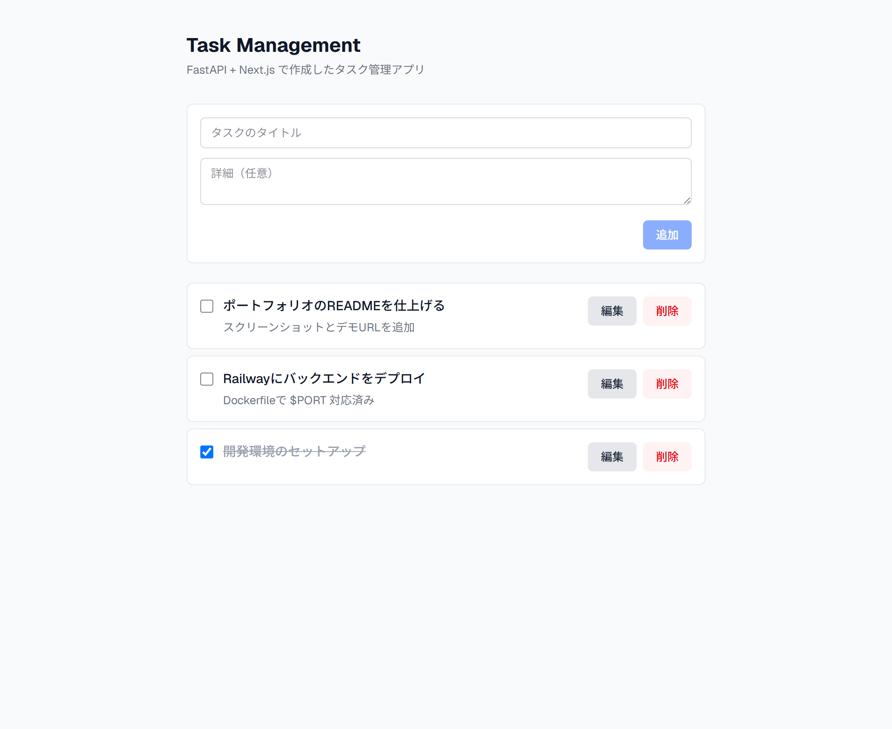
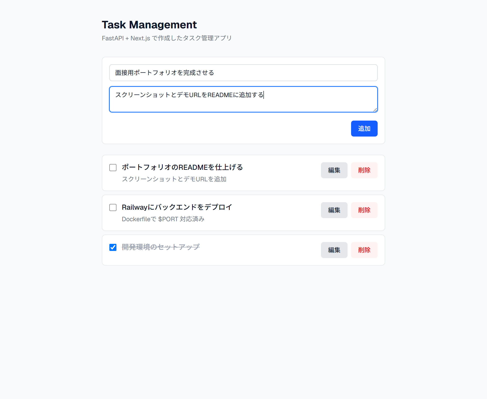
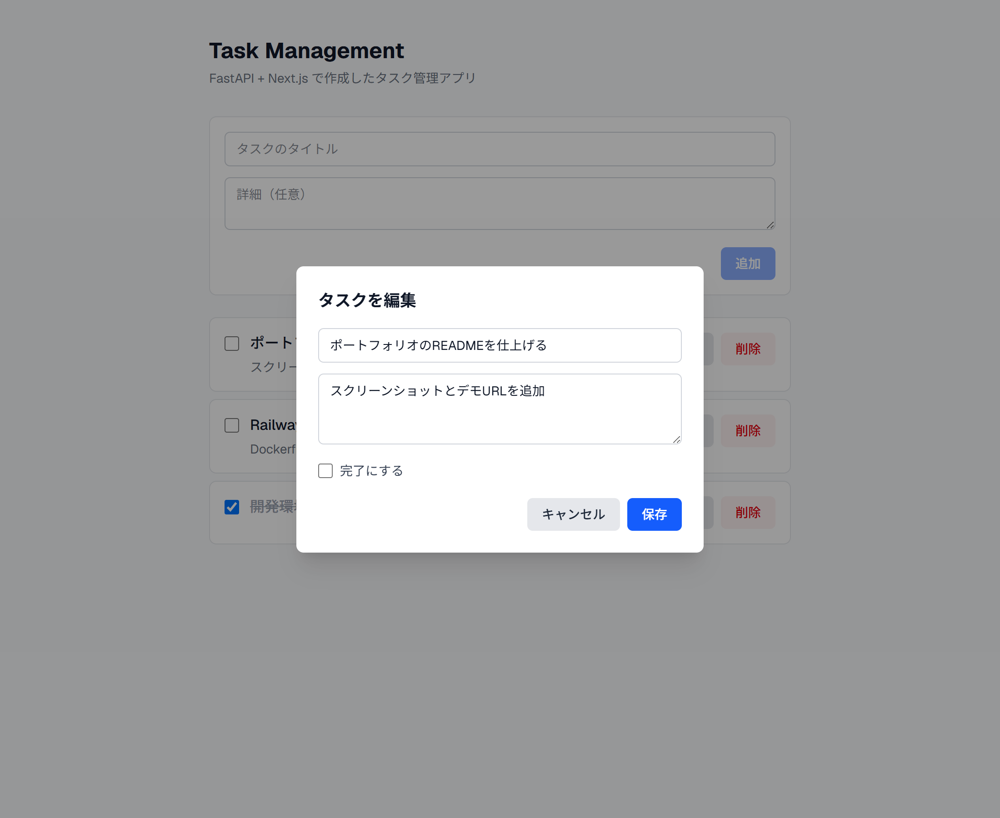

# Task Management

FastAPI + Next.js で構築したフルスタックのタスク管理アプリ。Portfolio Master Plan の Project 01。

## 概要

タスクの作成・一覧・更新・削除ができるフルスタックアプリです。バックエンドは Service / Repository 層を分離した実務レベルのレイヤー構成、フロントエンドは Next.js (App Router) + TypeScript で実装しています。

## 使用技術

### バックエンド
- Python 3.12 / FastAPI
- SQLAlchemy 2.0 / Pydantic v2
- SQLite（開発） / PostgreSQL（本番想定）
- pytest / httpx / Ruff

### フロントエンド
- Next.js (App Router) / React 19
- TypeScript (strict)
- Tailwind CSS

### インフラ / CI
- Docker / Docker Compose
- GitHub Actions（Ruff + pytest / ESLint + build）

## 機能一覧

- タスクの作成
- タスク一覧の取得・表示
- タスクの完了/未完了の切り替え
- タスクの更新（モーダル編集）
- タスクの削除

## システム構成

```text
Next.js UI (frontend)
  │ HTTP (fetch)
FastAPI (backend/app/api)
  │
Service層 (app/services)
  │
Repository層 (app/repositories)
  │
SQLAlchemy / SQLite
```

## セットアップ

### バックエンド

```bash
cd backend
python -m venv .venv
.venv/Scripts/activate  # Windows
pip install -r requirements.txt
cp ../.env.example .env
uvicorn app.main:app --reload
```

http://127.0.0.1:8000/docs でSwagger UIから動作確認できます。

### フロントエンド

```bash
cd frontend
npm install
cp .env.example .env.local
npm run dev
```

http://localhost:3000 で画面を確認できます（バックエンドを起動しておくこと）。

### Docker（バックエンド）

```bash
docker compose up --build
```

### テスト

```bash
cd backend
pytest -v
```

## API一覧

| Method | Path | 説明 |
|---|---|---|
| GET | /tasks | タスク一覧取得 |
| GET | /tasks/{id} | タスク詳細取得 |
| POST | /tasks | タスク作成 |
| PUT | /tasks/{id} | タスク更新 |
| DELETE | /tasks/{id} | タスク削除 |
| GET | /health | ヘルスチェック |

レスポンスは以下の形式に統一しています。

```json
{
  "success": true,
  "data": {},
  "message": "Success"
}
```

## ディレクトリ構成

```text
portfolio-01-task-management/
  backend/
    app/
      api/          # ルーティング
      core/         # 設定
      models/       # SQLAlchemyモデル
      schemas/      # Pydanticスキーマ
      services/     # ビジネスロジック
      repositories/ # DBアクセス
      db/           # DB接続
      main.py
    tests/
  frontend/
    app/            # App Router (page / layout)
    components/      # 共通UI (Button, Input, Modal)
    features/tasks/  # TaskList / TaskForm / TaskItem / TaskEditModal
    services/        # API通信 (api.ts, taskApi.ts)
    types/           # 型定義
    lib/             # 設定 (API base URL)
  docs/
    requirements.md  # 要件定義・設計書
  .github/workflows/ci.yml
  docker-compose.yml
```

詳細な設計は [docs/requirements.md](docs/requirements.md) を参照。

## スクリーンショット

> 撮影手順は [screenshots/README.md](screenshots/README.md) を参照。
> 下記のファイルを `screenshots/` に置くと表示されます。

<!--



-->

## デモURL

TODO: デプロイ後に追加する（手順: [docs/deploy.md](docs/deploy.md)）。

## 今後の改善点

- ログイン機能（JWT認証）
- 優先度・カテゴリ・検索機能
- Alembicによるマイグレーション管理
- PostgreSQL対応
- フロントエンドのデプロイ（Vercel）とバックエンドのデプロイ（Railway）
